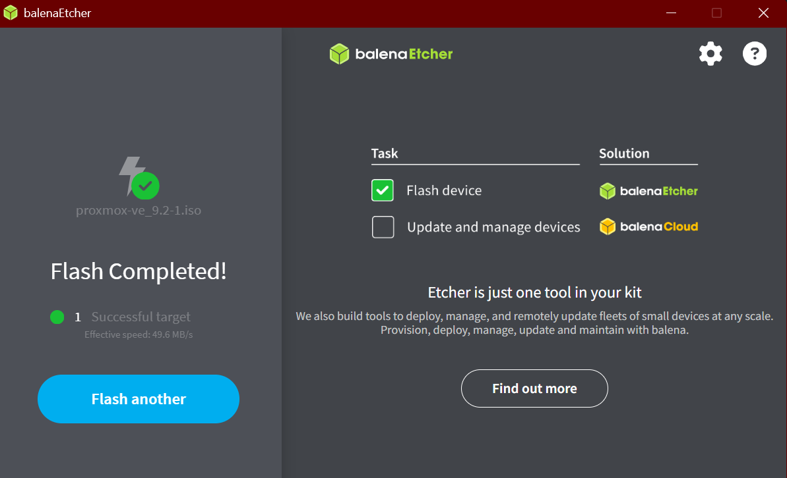
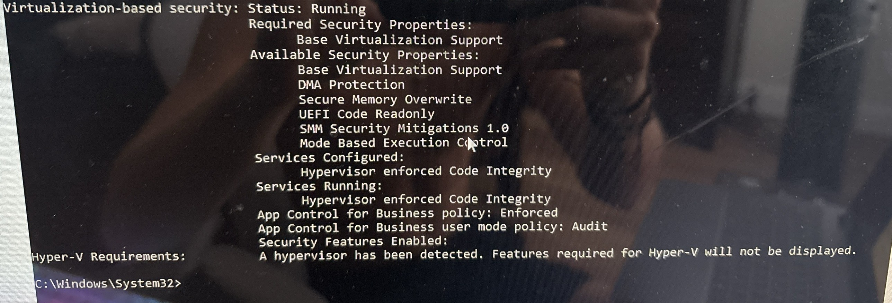
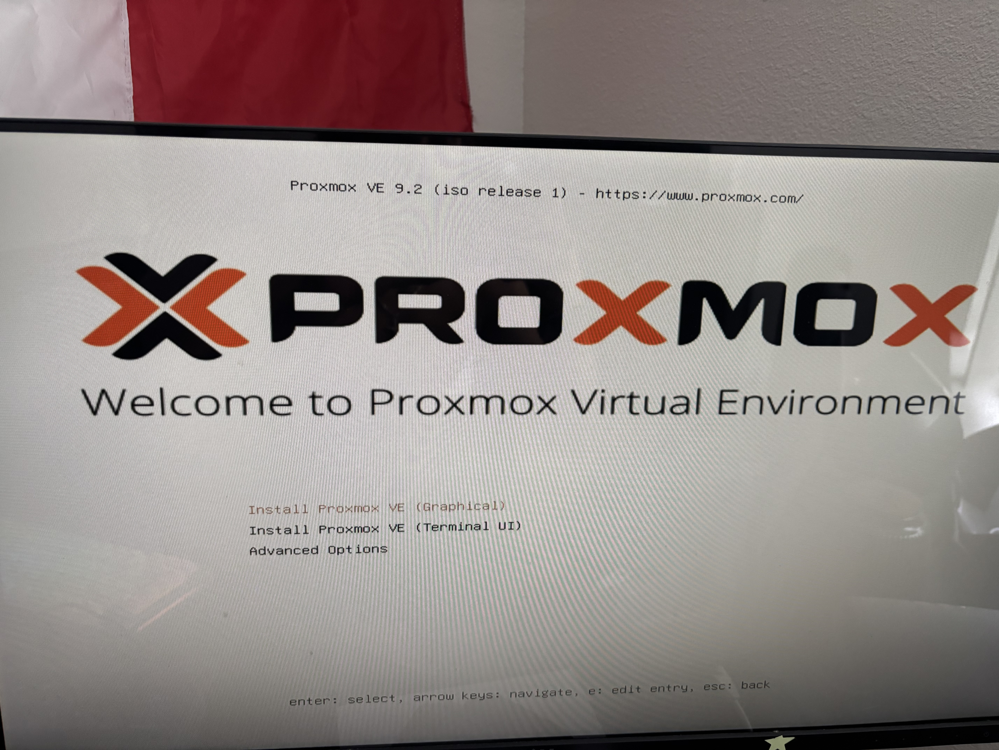
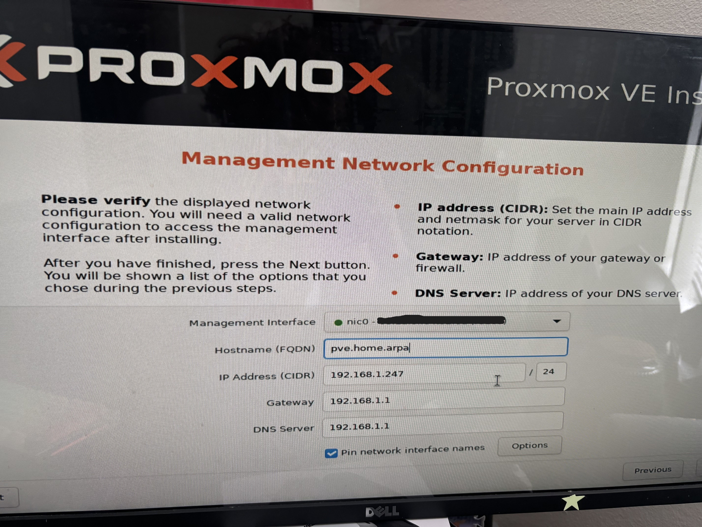
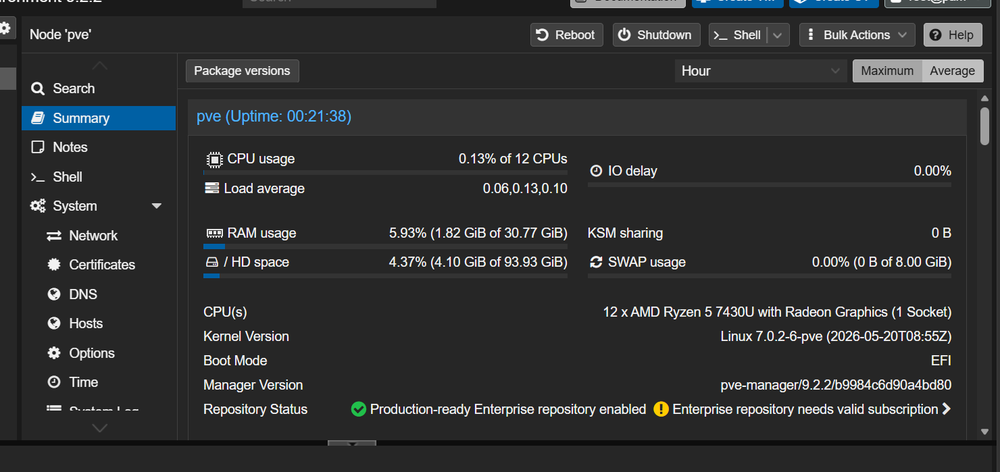
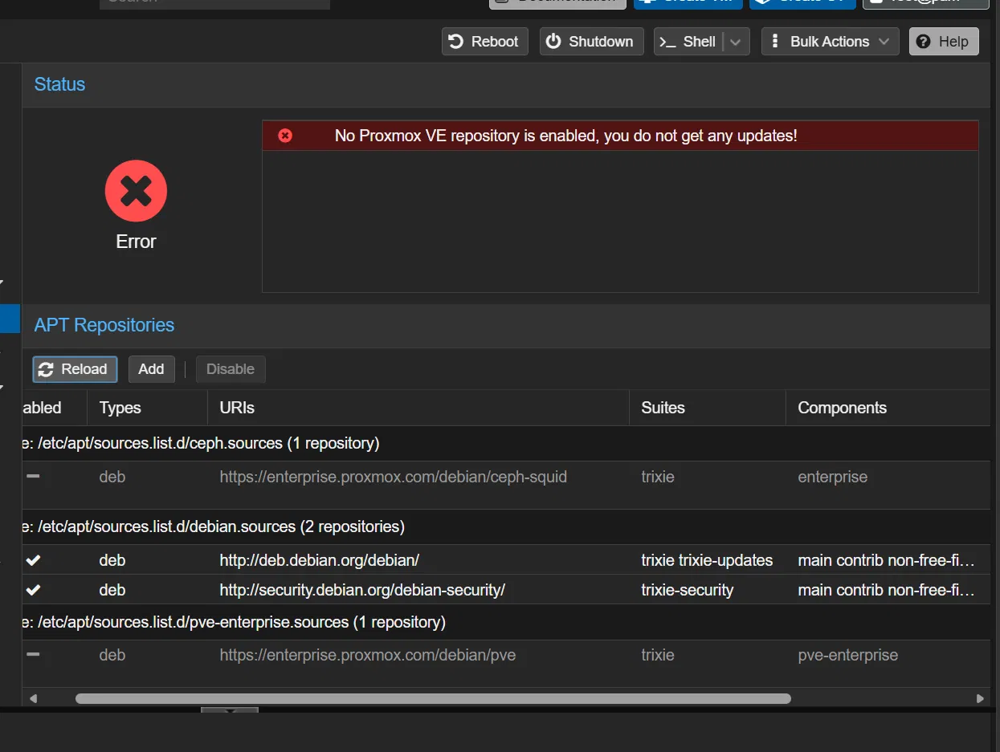
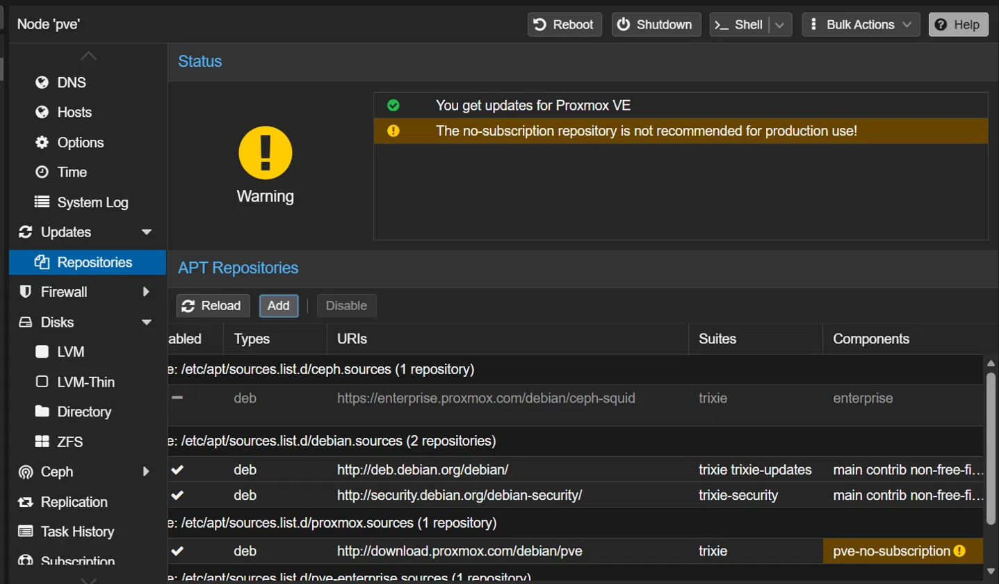
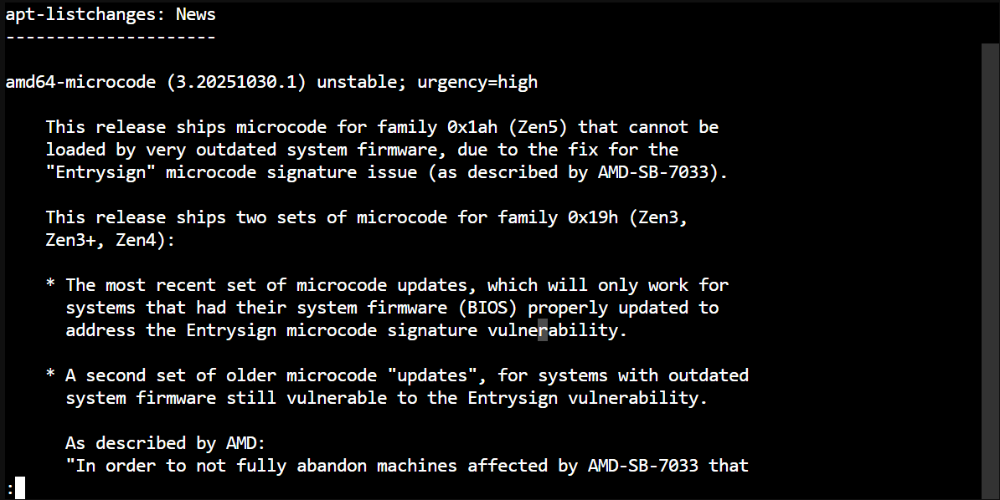
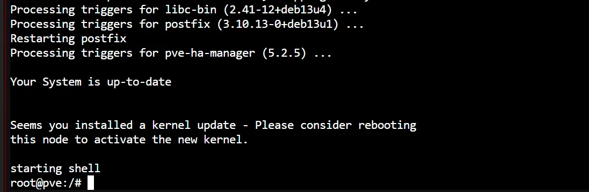
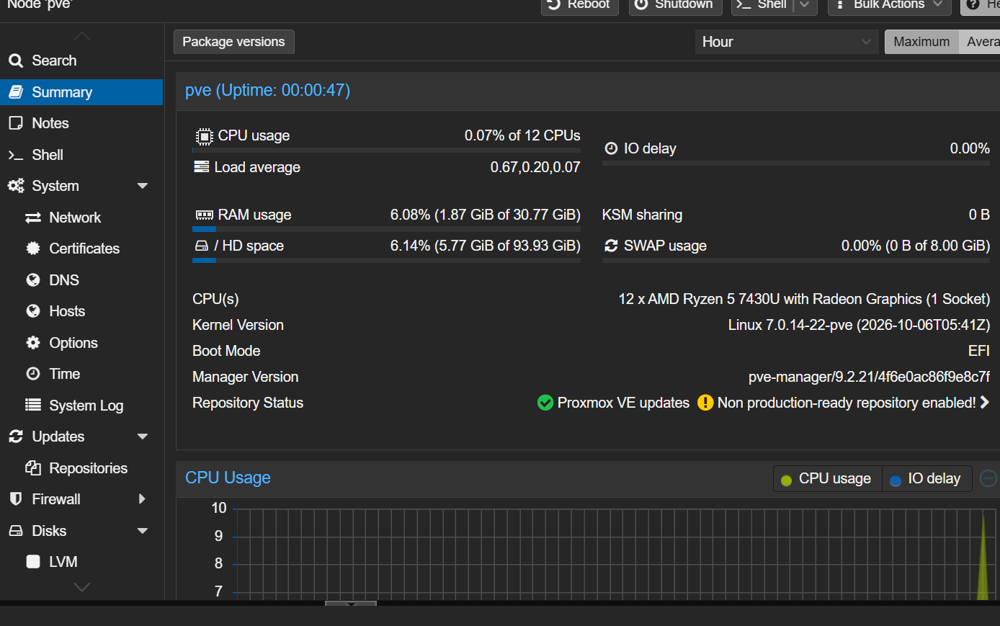

# Phase 1: Installing Proxmox

## Goal
Set up Proxmox for the lab. Proxmox splits one computer's CPU, RAM, and disk into separate virtual machines. This allows me to set up multiple machines at once on one mini PC instead of needing six separate computers.

## Hardware
- Mini PC with a Ryzen 5 7430U (6 cores, 12 threads)
- 32GB RAM, 512GB NVMe

## Steps

### 1. Made the installer USB
Downloaded the Proxmox VE 9.2 ISO to my laptop, then flashed it to a USB drive with Etcher to create a bootable installer. Copying the file onto the USB would not have worked, since the drive has to be written in a bootable format.

### 2. Confirmed virtualization was on
My keyboard wasn't working in the BIOS yet, so I checked from Windows instead. Running `systeminfo` in Command Prompt showed "A hypervisor has been detected" and virtualization-based security running, which is only possible if SVM (AMD's virtualization setting) is turned on.

### 3. Ran the installer
I chose the internal NVMe drive as the install target instead of the USB drive. I set the hostname to `pve.home.arpa` and wrote down the management IP, `192.168.1.247`, which is the address I use to reach the web interface from my laptop on port 8006.

### 4. Fixed the update repositories and patched
By default Proxmox points at the Enterprise repositories, which need a paid subscription, so updates failed. I disabled them and added the No-Subscription repository, then ran the upgrade and rebooted. The kernel went from 7.0.2-6 to 7.0.14-22 and Proxmox from 9.2.2 to 9.2.21. The upgrade also included an AMD CPU microcode package, with release notes about the Entrysign vulnerability.

## Problems I hit

### Keyboard not detected in BIOS
The mini PC ignored my keyboard at startup, so I couldn't press Delete to get into the BIOS and it booted straight into Windows. As a workaround, I booted the installer USB from inside Windows with `shutdown /r /o /t 0` and "Use a device." The real fix was switching the keyboard's cable and using a USB 2.0 port, after which it worked.

### Clicks not registering in the web interface
In Brave, clicks in the Proxmox web interface did nothing unless I clicked and then pressed space. Originally I believed the problem came from my laptop's touchscreen, but after turning it off the problem persisted. Switching to Microsoft Edge solved the issue. I haven't found the root cause yet.

## What I learned
- How to create a bootable drive from an .iso file using Etcher
- How to check system information from Command Prompt without going into the BIOS
- Troubleshooting peripheral input, starting with the cable
- How Proxmox runs multiple virtual machines on one physical computer, each with its own operating system

## Next
Phase 2: set up the lab's virtual networks and install a firewall in front of them.
